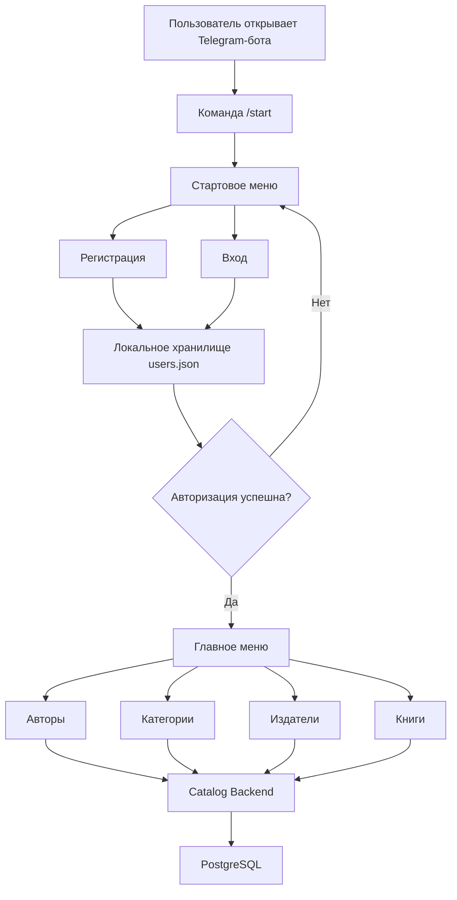
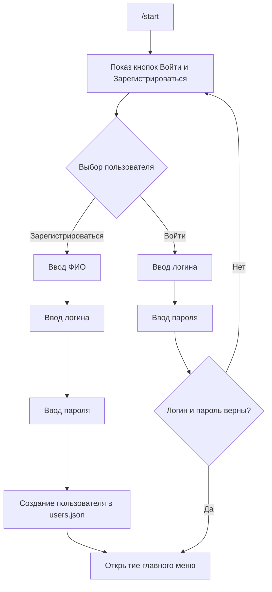
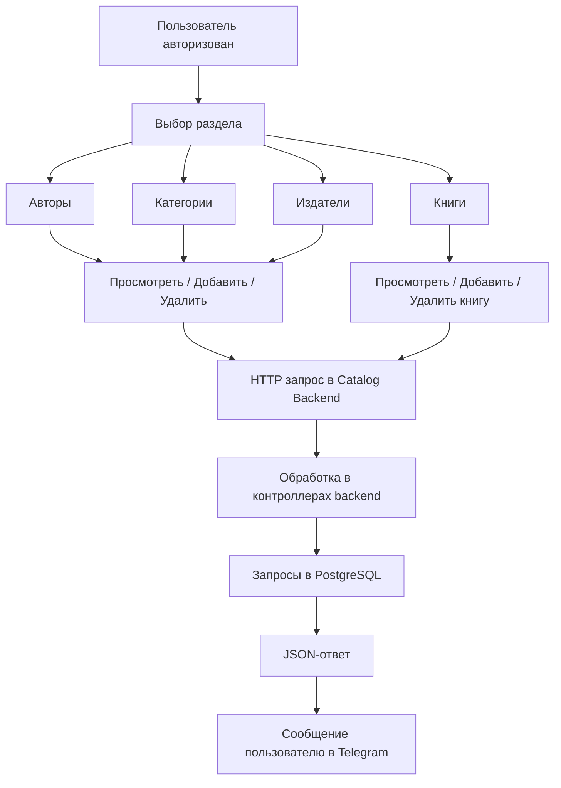
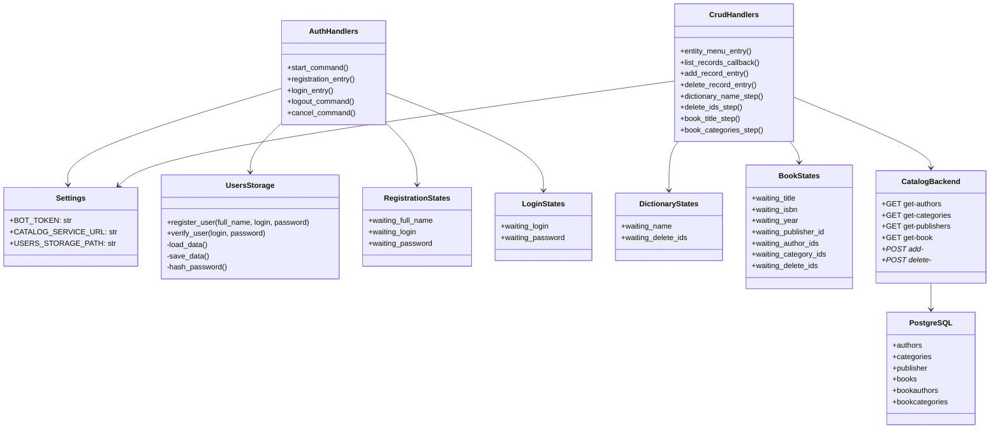
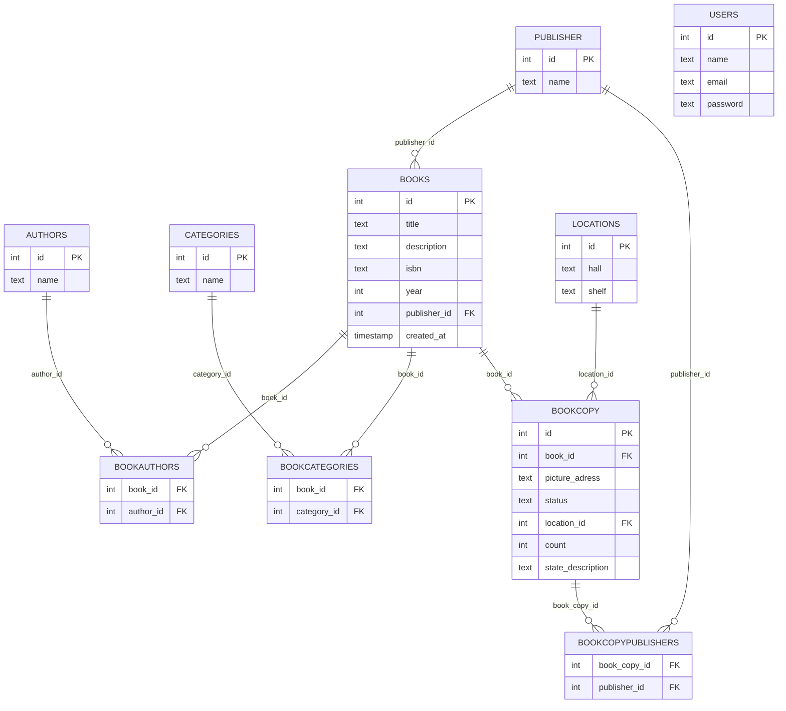

# Диаграммы проекта

## 1. Блок-схема общей работы системы

## 2. Блок-схема регистрации и входа

## 3. Блок-схема CRUD-операций

## 4. UML-диаграмма классов

## 5. ER-диаграмма базы данных

## 6. Краткое пояснение

- Бот состоит из двух основных частей: авторизация и CRUD.
- Авторизация в текущей версии локальная и использует `users.json`.
- Работа со справочниками и книгами идет через отдельный backend каталога.
- Backend каталога использует PostgreSQL.
- Диаграммы отражают текущую рабочую структуру проекта, которая используется в репозитории.

